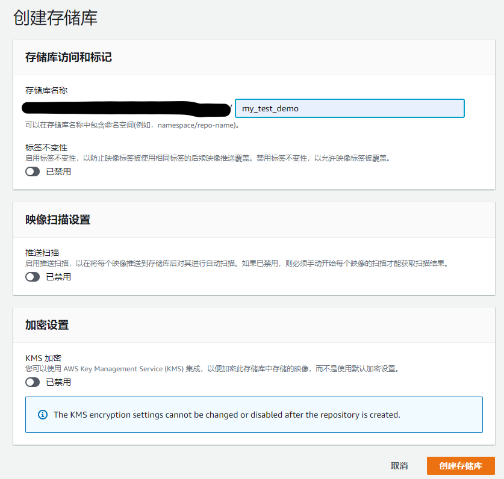
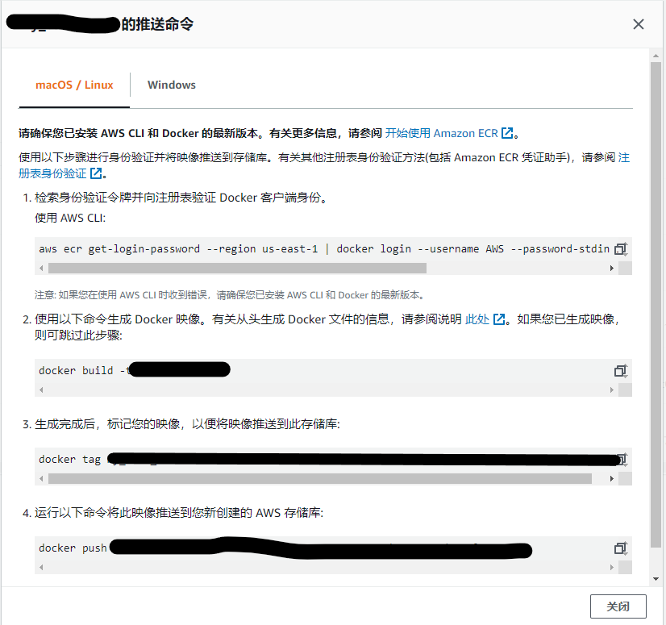
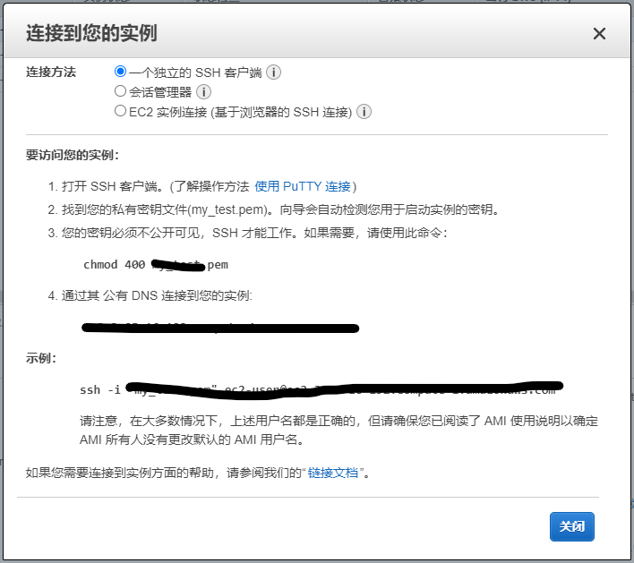

How to Deploy the App
===================
written by Elliot

**PART.1 AWS**
----------------
+ **关于AWS账号**  
   按照老师的教程我并没有注册到一个可用的正式的AWS账号，所以只有根据后半段教程创建了一个 **AWS Educate** 的账号，注册具体的过程可以参考PPT，需要注意的点就是申请邮箱要填学校邮箱，以及及时到邮箱里面点击验证邮件里面的链接。如果访问AWS比较慢的话建议使用交大VPN。
+ **使用AWS Educate**  
   AWS Educate的网址在这里 [AWS Educate](https://amazonaws-china.com/cn/education/awseducate/)  
   进去之后就就可以看到注册和登录的链接，点击登录。  

     
   
   用注册并激活过的邮箱和密码登录，就会进入下面的页面，点击右上角的 **AWS Account** 接着点击中间的按钮  

     

     

   这个时候就会被送到第三方的平台（接下来称为 **Workbench** ），通过这个平台可以查看当前账户剩余的费用，以及后面会用到的 **Account Detail**  

     

   **Account Detail** 可以查看AWS CLI的认证信息，**AWS Console** 可以转到AWS的控制台
+ **AWS 控制台**  
   AWS控制台的界面如下：  

    

   目前我们的项目主要用到的服务是  
   **EC2** —— 搭建虚拟机来运行服务器和前端  
   **Elastic Container Registry(ECR)** —— 储存Docker镜像  
   第一次可以在左上角的服务栏中找到
+ **密钥对**  
   密钥对是用来通过本机连接到远程服务器的，公钥保存在云端（AWS），私钥保存在本机（PC），一直都会用到的。在 **EC2** 控制面板的侧边栏可以找到，点击 **EC2** 进入页面（第一次使用好像页面不一样，但是创建第一个实例时会让你选择密钥对，那个时候也可以新建密钥对）  

    

   点击新建密钥对  

    

   随便输一个名字，选择 **.pem格式** ，点击新建，就会弹出一个下载保存的窗口，把密钥对的私钥保存在本地某个地方，一定要记好自己密钥对的保存位置和名字。

    

   这样就会看到有新的密钥对了，接下来的所有需要密钥的地方我们都使用这一个密钥对就可以了。
+ **创建 EC2 实例**  
   接下来我们创建一个 EC2 实例。一个实例就是一个挂载在 AWS 上的虚拟机，我们通过远程连接可以接入并操作这个虚拟机，然后在上面部署我们的 Web App。按理来说我们的前端和后端都需要部署，我是把他们部署到了两个不同的虚拟机上，创建方法是一样的，只是之后操作虚拟机的步骤不一样。  
   在 **EC2** 的界面点击 **启动实例** 就会进入下面的页面，选择虚拟机的系统，我选择的是第二个。

    

    

   接着还要选实例类型，应该默认选的是标有免费的那个。一般来说后面可以用默认的配置，但是我还是简单自己配置一下，点击 **下一步**

    

   步骤3我没有改动它，直接点 **下一步**  

    

   这里添加储存，8G其实也没什么大问题好像，但是免费的额度可以有30G

    

   这里添加标签，给实例标一下名字，表示是服务器端。

    

   配置安全组，先可以像我这样弄，SSH的22端口是用来连接本机和实例，8080端口是访问我们的后端，80端口好像暂时没什么用。其他的还有 MongoDB 的 27017，MySQL 的 3306，Grafana 的 3000，Prometheus 的 9090 那些，都不用急着配，后面实例运行起来之后都是可以再改的，重点就是为了方便我把来源设置成了任何位置。

    

   接着就可以点审核启动了，等待它审核启动，到 EC2 的控制面板去看，如果刚刚创建的实例的状态是下面这样就是可以用了。

    

   关于实例连接的部分就可以看 **WSL** 相关的部分了。接下来介绍 **ECR**
+ **使用 ECR 和推送镜像**  
   首先进入 ECR 的页面，选择新建储存库，然后填写储存库的名称就可以了。  

   

   

   接着会回到上一级页面，点击储存库的名字进入储存库，点击右上角的查看推送命令，可以查看如何连接到储存库以及拉取、上传镜像。

     

   在这里首先解释一下我们的项目的 Docker 的结构，有五个容器，容器内都是 Linux 的环境，分别运行着 *后端*，*MySQL*，*MongoDB*，*Grafana*，*Prometheus*。后面四个的镜像都是从源地址（Docker的源可以换成阿里云）拉取的，后端的镜像就是 Springboot 中用 Maven 打包出来的 jar 包（IDEA里面橙黄色的那个目录）。  
   接下来要做的就是在 Windows 系统上连接 ECR 然后把 jar 包推送到 ECR 中，这样我们就可以在云端的服务器上拉取这个镜像。  
   首先确保 Windows 系统已经安装了 Docker（这个教程我就没有囊括了，搜索的话搜 Docker Desktop的教程就好，只需要有 Docker 就可以了。注意所有涉及到 Docker 的命令都要在 Docker Desktop 在运行的前提下才能执行）  
   接着安装 AWS CLI，就是 AWS 的命令行工具，具体的步骤参看官方文档：[AWS CLI安装方法](https://docs.aws.amazon.com/zh_cn/cli/latest/userguide/install-cliv2-windows.html)  
   安装好 AWS CLI 之后就可以把本机与 ECR 先连接了，因为 ECR 是私有库，需要先认证，找到 *C://USER/XXX/.aws* 目录（XXX是本机用户名），记事本方式打开 **credentials** 文件，接着用 **Workbench** 里面 **Account Detail** 里面的 **AWS CLI** 的认证内容*覆盖* **credentials** 的内容并保存。（这个认证信息过一段时间会变，如果你后续再连接报错说 token 信息不对，可能要重新执行一遍这个步骤）  

    

   接下来在储存库的界面点击 **查看推送命令** 可以看到 Linux 和 Windows 系统的连接和推送方法。注意这里实际上要用的是 **Linux** 的命令。

    

   把第一行命令直接复制到命令行中执行，应该就会返回 **Login Succeed** 说明已经把 Windows 和 ECR 连到一起了。（注意这个时候 Docker 是需要启动的）

    

   接下来再 **项目目录** 下（就是有 Dockerfile 的那个目录下，也就是IDEA自带的控制台的默认路径下），执行第二个命令  
   ```
   docker build -t name:tag .  //一定要注意最后有一个点 . 
   ```
   就可以把 jar 包 build 为 docker 的镜像了。(至于 jar 包打包请打开 **IDEA > View > Tool Window > Maven**, 选择里面的 package 并执行即可。)  
   接下来执行第三个命令，把自己刚刚命名的镜像标记为 ECR 给的这个名字（虽然我不知道有什么用）。  
   最后执行第四个命令就可以把镜像推送到 ECR 的储存库里面了。可以在储存库里面找到就说明成功了，是可以拉取的镜像了。

**PART.2 WSL**
----------------------
+ **关于 WSL**  
   WSL 是 Windows Subsystem for Linux 的简称，相当于之前用的 VMware 虚拟机的感觉吧，但是体量更轻，更方便。具体的安装教程可以看：[WSL安装教程](https://zhuanlan.zhihu.com/p/105652962) 网上教程比较多，只要最后能够在 Microsoft Stire 的应用市场搜索下载 **Ubuntu** 然后可以跑出来它的控制台界面就可以了（如下）。  
   *PS：WSL默认安装子系统的位置是 C 盘，所以介意的话可以搜一下怎么改变子系统的存储路径。*

    

+ **开始使用 WSL 连接 EC2**  
   刚开始使用 WSL 需要安装一些必要的软件，一般来说都不要紧，遇到报错说命令不存在的时候再到 *root* 下 **apt-get**（有些是 **yum**）安装一下就好了。  
   为了后续的连接需要先准备密钥，先在 *~* 目录下面 **mkdir** 新建一个文件夹，然后 **cd** 到 *mnt* 目录下， **ls** 发现这个目录就是本机的硬盘的目录，找到之前保存的密钥文件，然后执行下面的命令把它复制到之前新建的文件夹里面去 
   ``` 
   xxx@user> cp xxx.pem ~/xxx  
   ```
   接下来回到那个文件夹，输入下面的命令给这个密钥文件权限（可能要在 root 下） 
   ``` 
   xxx@user> chmod 400 xxx.pem  
   ```
   然后就可以通过 SSH 连接到之前我们创建的实例虚拟机上了  
   ```
   xxx@user> ssh -i xxx.pem xxx@xxx.compute-1.amazonaws.com
   ```  
   这里的这些命令的具体值，可以在 EC2 的控制台的实例界面，点击左上角连接查看  

      

      

   注意这里官方给的命令里面，密钥文件加了双引号，但是我好像这样执行不了，是去掉双引号之后就可以的。  
   接下来 Ubuntu 的命令行界面就变成了操作 EC2 实例的命令行了，之后每一次连接实例的方法都是相同的，注意不同的实例是可以用同一个密钥的，但是连接的时候实例本身的名字不一样。

**PART.3 EC2**
----------------
+ **使用 EC2 实例**  
   理一下我们现在的处境，我们在 Windows 的一个 Ubuntu 子系统上面，远程连接了一个 EC2 的 Linux 实例，正在操作它的命令行。  
   接下来需要在这个 EC2 部署我们的 Docker 项目。  
   首先要设置 root 的密码，一般的实例默认是没有密码的，需要设置  
   ```
   ec2-user@xxx> sudo passwd root  
   ```
   接下来输入密码确认就可以了。  
   进入 root 模式后 *apt-get install* 或者 *yum install -y* 来下载 *docker* 和 *awscli*  
   注意需要  
   ```
   ec2-user@xxx> service docker start
   ```
   来启动 Docker 服务  
+ **准备一些文件**
   在 EC2 中新建一个文件夹 *app* ，然后准备以下文件：**detail.json**, **ticket_demo.sql**, **docker-compose.yaml**, **prometheus.yml**。这些文件有两个方法，一是新建然后复制我们项目中对应文件的内容（命令行复制可以用右键点光标），也可以用后面会讲的 **WinSCP** 直接传文件（这个更方便）。  
+ **EC2 连接 ECR**  
   在 EC2 上安装 AWS CLI 之后，**~** 目录下会出现一个 **.aws** 文件夹，可以用 *ls -al* 命令查看。里面同样的会有一个 *credentials* 文件，用之前同样的方法覆盖里面的认证信息，用之前同样的方法就可以连接到 ECR 了（只用 Login Succeed 就可以了）  
   接着输入下面的命令拉取之前我们上传的镜像，镜像的名字就是之前 push 的那个。  
   *docker pull xxxxxxx*  
   这样接下来部署的时候就可以用了。  
   另外还有一种情况，是这个实例是自带 AWS CLI 的（就是安装的时候提示你已安装），它的目录好像就会不一样，所以可以用下面的命令设置认证信息  
   ```
   aws configure
   ```
   接着填写对应的项目的内容，注意 region 那项填 **us-east-1**。此外还需要用
   ```
   aws configure set aws_session_token xxxxxxxxx
   ```
   把最后一项的内容填进去，再尝试连接 ECR 就可以了。
+ **EC2 部署 Docker**
   请确保上面的步骤都完成了。  
   在 *app* 目录下（就是有 docker-compose.yaml 文件的那个目录）输入命令  
   ```
   docker-compose up
   ```
   就可以自动完成部署的工作了。（如果提示没有这个命令，或许需要再安装一下 docker-compose，可以看官方的文档：[Docker-compose安装](https://docs.docker.com/compose/install/) ）  
   这个时候应该会自动拉取镜像，部署容器，然后一大堆各色代码飞过，如果不想看见这些的话请输入  
   ```
   docker-compose up -d
   ```
   或者稳定后直接关闭 Ubuntu 的窗口（不是按 Ctrl+C ！）在重新打开 Ubuntu 重新连接到 EC2 也可以继续操作。
+ **Mysql 和 MongoDB**  
   新部署的 Docker 里面跑的数据库是没有数据的。  
   在 EC2 的命令行输入下面的命令  
   ```
   ec2-user@xxx> docker ps 
   ```
   可以查看容器状况，每一列有一条是容器的名字。输入  
   ```
   ec2-user@xxx> docker exec -it 容器的名字 bash  
   ```
   可以进入容器操作。如果报错没有 bash 什么的，可以试一下 bash 改成 sh  
   在 MySQL 的容器里面的命令行输入 *mysql -uroot -p* 进入 MySQL 密码是 root  
   然后创建 database *ticket_gathering* （反正要和你的 jar 包里面的后端里面的配置的名字一样），然后 use 这个 db， 输入  
   ```
   source /opt/app/ticket_demo.sql;
   ```
   就可以导入 MySQL 的数据了。  
   同样的方法进入 MongoDB 的容器，直接在容器的命令行输入  
   ```
   mongoimport --db ticket --collection ticketdetail --file /opt/app/detail.json
   ``` 
   显示导入了 1335 条数据就可以了。
   这样后端应该就可以直接访问了。具体的 IP 地址在 EC2 实例的控制面板下面的信息里有。

**PART.4 WinSCP**
--------------
+ **关于 WinSCP**  
   WinSCP 用来在本机和云端虚拟机之间传文件。  
   安装教程请百度  
   打开之后会弹出登录界面  

      

   主机名填要连的那个 EC2 实例的**公有 IP 地址**，端口为 **22** ，用户名为 **ec2-user**（如果之前的步骤都跟我一样的话）  
   然后点 **高级>SSH>验证>验证参数>工具>使用PuTTYgen生成新的密钥对**   

     
   
   点击 **load**，找到之前保存在本地的密钥 .pem 文件（要在右下角把文件类型改成 All Files）  

     

   之后点击 **Save private key** 保存转换成的 .ppk 文件  

     

   最后再选择刚刚生成的 .ppk 文件，点击 **登录** 等待连接即可。
   接下来的操作包括新建文件夹、传送文件都很简单了。

**PART.5 Front End**
---------------------
+ **前端代码打包**  
   首先在前端的代码目录下执行
   ```
   npm run build
   ```
   完了就会有一个 **build** 文件夹（橙黄色的），这个就是打包好的前端。 
   
    
+ **前端部署**  
   用上面同样的方法**新建一个 EC2 实例**，用来部署前端，具体的方法请翻回去看。  
   然后用 WinSCP 把刚刚打包的 build 文件夹整个复制到实例中的某个位置。  
   接着用 WSL 连接到实例之后先安装 Nginx  
   ```
   yum install -y nginx
   ```
   安装好后启动 Nginx 服务
   ```
   service nginx start
   ```
   然后到它的根目录下面去修改默认的配置  
   ```
   cd /etc/nginx
   vi nginx.conf
   ```
   然后修改一下图中标注的位置，注意 root 的路径是自己刚刚保存 build 的路径。（在 root 模式下才能该这个文件）

    

   修改好后重启 Nginx 服务
   ```
   service nginx restart
   ```
   之后就可以在这个部署了前端的实例的 IP 地址访问前端的页面了。 

   *PS: 前端的代码里面我把 url 改成了一个常量在 src/Constant/constant.js ，如果你们想自己部署一下后端，需要把这个常量的值改成自己后端的 IP 地址。*  

**至此我们的项目的前后端都已经部署完毕了，应该没有什么问题是可以访问的了，如果遇到什么问题就问我吧**
--------------------------------

